# Database ERD Diagram

## Overview

This ERD diagram represents the complete database schema for the KonstruksiAI platform, showing relationships between master data tables, runtime tables, and evaluation tables for agentic workflows.

## Entity Relationship Diagram

```mermaid
erDiagram
    %% Master Data Tables
    BUSINESS_ENTITIES ||--o{ LICENSES_PERMITS : has
    BUSINESS_ENTITIES ||--o{ BUSINESS_CERTIFICATIONS : holds
    BUSINESS_ENTITIES ||--o{ PERSONNEL : employs
    BUSINESS_ENTITIES ||--o{ PROJECTS : executes
    BUSINESS_ENTITIES ||--o{ TENDERS : participates

    PERSONNEL ||--o{ PERSON_COMPETENCIES : possesses
    PERSONNEL ||--o{ PERSON_CERTIFICATIONS : holds
    PERSONNEL ||--o{ TRAINING_RECORDS : completes
    PERSONNEL ||--o{ CPD_RECORDS : maintains

    REGULATIONS ||--o{ REGULATORY_OBLIGATIONS : creates
    REGULATORY_OBLIGATIONS ||--o{ COMPLIANCE_FINDINGS : generates

    TRAINING_PROGRAMS ||--o{ TRAINING_RECORDS : produces
    TRAINING_PROGRAMS ||--o{ PERSON_CERTIFICATIONS : enables

    %% Runtime Tables
    AGENT_REQUESTS ||--o{ WORKFLOW_RUNS : initiates
    WORKFLOW_RUNS ||--o{ AGENT_TASKS : contains
    AGENT_TASKS ||--o{ AGENT_TASK_OUTPUTS : produces
    AGENT_TASKS ||--o{ TOOL_CALLS : executes

    %% Evidence & Requirements
    REQUIREMENT_ITEMS ||--o{ REQUIREMENT_EVALUATIONS : assessed
    REQUIREMENT_EVALUATIONS ||--o{ EVIDENCE_LINKS : supported
    EVIDENCE_LINKS ||--o{ DOCUMENTS : references

    %% Evaluation & Scoring
    REQUIREMENT_EVALUATIONS ||--o{ READINESS_SCORES : contributes
    READINESS_SCORES ||--o{ VERIFICATION_RESULTS : validated
    VERIFICATION_RESULTS ||--o{ FINAL_ASSESSMENTS : aggregates

    %% Agent Operations
    AGENT_RUNS ||--o{ AGENT_TASK_OUTPUTS : generates
    AGENT_RUNS ||--o{ EVIDENCE_MAPPINGS : creates
    AGENT_RUNS ||--o{ AUDIT_EVENTS : logs

    %% Cross-References
    EVIDENCE_MAPPINGS ||--o{ DOCUMENTS : maps
    EVIDENCE_MAPPINGS ||--o{ REGULATORY_OBLIGATIONS : links
    EVIDENCE_MAPPINGS ||--o{ REQUIREMENT_ITEMS : associates

    COMPLIANCE_FINDINGS ||--o{ REGULATORY_OBLIGATIONS : addresses
    COMPLIANCE_FINDINGS ||--o{ EVIDENCE_LINKS : supported
    COMPLIANCE_FINDINGS ||--o{ AUDIT_EVENTS : audited

    %% Table Definitions with Key Fields

    BUSINESS_ENTITIES {
        bigint id PK
        varchar entity_name
        varchar entity_type
        varchar registration_number
        varchar tax_id
        varchar address
        varchar contact_email
        varchar contact_phone
        jsonb metadata
        timestamp created_at
        timestamp updated_at
    }

    LICENSES_PERMITS {
        bigint id PK
        bigint entity_id FK
        varchar license_type
        varchar license_number
        varchar issuing_authority
        date issue_date
        date expiry_date
        varchar status
        jsonb requirements_met
        timestamp created_at
        timestamp updated_at
    }

    BUSINESS_CERTIFICATIONS {
        bigint id PK
        bigint entity_id FK
        varchar certification_type
        varchar certification_body
        varchar certificate_number
        date issue_date
        date expiry_date
        varchar status
        jsonb classification_details
        timestamp created_at
        timestamp updated_at
    }

    PERSONNEL {
        bigint id PK
        bigint entity_id FK
        varchar full_name
        varchar position
        varchar employee_id
        date birth_date
        varchar education_level
        integer years_experience
        varchar contact_email
        varchar contact_phone
        jsonb skills_profile
        timestamp created_at
        timestamp updated_at
    }

    PERSON_COMPETENCIES {
        bigint id PK
        bigint personnel_id FK
        varchar competency_type
        varchar competency_level
        varchar issuing_body
        date assessment_date
        date expiry_date
        varchar status
        jsonb assessment_details
        timestamp created_at
        timestamp updated_at
    }

    PERSON_CERTIFICATIONS {
        bigint id PK
        bigint personnel_id FK
        varchar certification_type
        varchar issuing_body
        varchar certificate_number
        date issue_date
        date expiry_date
        varchar status
        jsonb certification_details
        timestamp created_at
        timestamp updated_at
    }

    TRAINING_PROGRAMS {
        bigint id PK
        varchar program_name
        varchar provider
        varchar program_type
        integer duration_hours
        varchar competency_focus
        jsonb curriculum_details
        timestamp created_at
        timestamp updated_at
    }

    TRAINING_RECORDS {
        bigint id PK
        bigint personnel_id FK
        bigint training_program_id FK
        date completion_date
        integer hours_completed
        varchar grade
        varchar certificate_number
        jsonb training_details
        timestamp created_at
        timestamp updated_at
    }

    CPD_RECORDS {
        bigint id PK
        bigint personnel_id FK
        varchar activity_type
        varchar activity_name
        integer cpd_points
        date activity_date
        varchar provider
        jsonb activity_details
        timestamp created_at
        timestamp updated_at
    }

    REGULATIONS {
        bigint id PK
        varchar regulation_name
        varchar regulation_code
        varchar issuing_authority
        date effective_date
        varchar category
        text description
        jsonb requirements
        timestamp created_at
        timestamp updated_at
    }

    REGULATORY_OBLIGATIONS {
        bigint id PK
        bigint regulation_id FK
        varchar obligation_type
        varchar entity_type
        varchar frequency
        date due_date
        varchar status
        jsonb obligation_details
        timestamp created_at
        timestamp updated_at
    }

    TENDERS {
        bigint id PK
        varchar tender_number
        varchar tender_name
        varchar procuring_entity
        decimal estimated_value
        varchar category
        date submission_deadline
        varchar status
        jsonb requirements
        timestamp created_at
        timestamp updated_at
    }

    PROJECTS {
        bigint id PK
        bigint entity_id FK
        varchar project_name
        varchar project_type
        decimal contract_value
        date start_date
        date completion_date
        varchar status
        jsonb project_details
        timestamp created_at
        timestamp updated_at
    }

    DOCUMENTS {
        bigint id PK
        varchar document_name
        varchar document_type
        varchar file_path
        varchar mime_type
        bigint file_size
        varchar upload_source
        varchar extracted_text
        jsonb metadata
        timestamp created_at
        timestamp updated_at
    }

    COMPLIANCE_FINDINGS {
        bigint id PK
        bigint entity_id FK
        bigint regulation_id FK
        varchar finding_type
        varchar severity
        varchar status
        text description
        jsonb evidence
        date due_date
        timestamp created_at
        timestamp updated_at
    }

    %% Runtime Tables

    AGENT_REQUESTS {
        bigint id PK
        varchar request_type
        varchar agent_type
        jsonb input_data
        varchar status
        timestamp created_at
        timestamp updated_at
    }

    WORKFLOW_RUNS {
        bigint id PK
        bigint request_id FK
        varchar workflow_type
        varchar status
        jsonb workflow_state
        timestamp started_at
        timestamp completed_at
        timestamp created_at
        timestamp updated_at
    }

    AGENT_TASKS {
        bigint id PK
        bigint workflow_run_id FK
        varchar agent_name
        varchar task_type
        jsonb task_input
        varchar status
        jsonb task_output
        timestamp started_at
        timestamp completed_at
        timestamp created_at
        timestamp updated_at
    }

    AGENT_TASK_OUTPUTS {
        bigint id PK
        bigint agent_task_id FK
        varchar output_type
        jsonb output_data
        varchar confidence_level
        jsonb metadata
        timestamp created_at
        timestamp updated_at
    }

    TOOL_CALLS {
        bigint id PK
        bigint agent_task_id FK
        varchar tool_name
        jsonb tool_input
        jsonb tool_output
        varchar status
        timestamp executed_at
        timestamp created_at
        timestamp updated_at
    }

    AGENT_RUNS {
        bigint id PK
        varchar agent_name
        varchar run_type
        jsonb input_data
        jsonb output_data
        varchar status
        timestamp started_at
        timestamp completed_at
        timestamp created_at
        timestamp updated_at
    }

    EVIDENCE_MAPPINGS {
        bigint id PK
        bigint document_id FK
        bigint requirement_id FK
        varchar mapping_type
        decimal confidence_score
        jsonb mapping_details
        varchar status
        timestamp created_at
        timestamp updated_at
    }

    AUDIT_EVENTS {
        bigint id PK
        varchar event_type
        varchar entity_type
        bigint entity_id
        varchar action
        jsonb old_values
        jsonb new_values
        varchar user_id
        timestamp created_at
    }

    REQUIREMENT_ITEMS {
        bigint id PK
        varchar requirement_type
        varchar category
        text description
        jsonb criteria
        varchar priority
        timestamp created_at
        timestamp updated_at
    }

    REQUIREMENT_EVALUATIONS {
        bigint id PK
        bigint requirement_item_id FK
        bigint entity_id FK
        varchar evaluation_type
        varchar status
        decimal score
        jsonb evaluation_details
        timestamp evaluated_at
        timestamp created_at
        timestamp updated_at
    }

    EVIDENCE_LINKS {
        bigint id PK
        bigint requirement_evaluation_id FK
        bigint document_id FK
        varchar link_type
        decimal relevance_score
        jsonb link_details
        timestamp created_at
        timestamp updated_at
    }

    READINESS_SCORES {
        bigint id PK
        bigint requirement_evaluation_id FK
        varchar score_type
        decimal score_value
        varchar score_category
        jsonb scoring_details
        timestamp calculated_at
        timestamp created_at
        timestamp updated_at
    }

    VERIFICATION_RESULTS {
        bigint id PK
        bigint readiness_score_id FK
        varchar verification_method
        boolean verified
        jsonb verification_details
        varchar verified_by
        timestamp verified_at
        timestamp created_at
        timestamp updated_at
    }

    FINAL_ASSESSMENTS {
        bigint id PK
        bigint entity_id FK
        varchar assessment_type
        varchar overall_status
        decimal overall_score
        jsonb assessment_summary
        jsonb recommendations
        timestamp assessed_at
        timestamp created_at
        timestamp updated_at
    }
```

## Key Relationships Explained

### Master Data Layer
- **Business Entities** are the core entities (companies, contractors) that hold licenses, certifications, employ personnel, and participate in tenders/projects
- **Personnel** possess competencies, hold certifications, complete training, and maintain CPD records
- **Regulations** create obligations that generate compliance findings
- **Training Programs** produce training records and enable certifications

### Runtime Layer
- **Agent Requests** initiate **Workflow Runs** that contain multiple **Agent Tasks**
- **Agent Tasks** produce **Task Outputs** and execute **Tool Calls**
- **Agent Runs** generate **Evidence Mappings** and log **Audit Events**

### Evaluation Layer
- **Requirement Items** are assessed through **Requirement Evaluations** supported by **Evidence Links**
- **Evaluations** contribute to **Readiness Scores** that are validated by **Verification Results**
- **Final Assessments** aggregate all evaluations for executive decision-making

### Cross-Domain Intelligence
- **Evidence Mappings** connect documents to regulatory obligations and requirements
- **Compliance Findings** address obligations and are supported by evidence links
- **Audit Events** track all changes across the system for full traceability

## Database Design Principles

### Normalization
- All tables are in 3NF to eliminate redundancy
- Foreign keys maintain referential integrity
- JSONB fields store flexible metadata without schema changes

### Performance Optimization
- Primary keys are bigint for scalability
- Timestamps enable time-based queries and auditing
- Status fields enable efficient filtering
- Indexes recommended on frequently queried fields (entity_id, status, created_at, expiry_date)

### Data Integrity
- Foreign key constraints prevent orphaned records
- Check constraints on status and score fields
- Audit triggers on critical tables for compliance

### Scalability
- Partitioning strategy for large tables (audit_events, agent_task_outputs)
- Archiving policy for completed workflows after 2 years
- Read replicas for reporting queries

## Migration Strategy

### Phase 1: Foundation (Master Data)
1. Create all master data tables
2. Establish foreign key relationships
3. Add indexes and constraints
4. Populate reference data

### Phase 2: Runtime Layer
1. Add agent and workflow tables
2. Create evidence mapping tables
3. Add audit and monitoring tables
4. Test agent workflows

### Phase 3: Evaluation Layer
1. Add requirement and scoring tables
2. Create final assessment tables
3. Add verification workflows
4. Enable full agent orchestration

This ERD provides the complete blueprint for the KonstruksiAI database architecture, supporting both traditional CRUD operations and advanced agentic workflows.</content>
<parameter name="filePath">database-erd.md