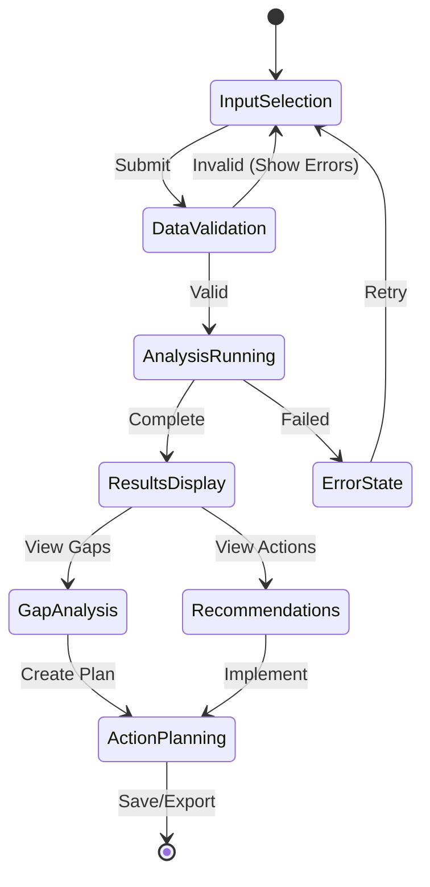
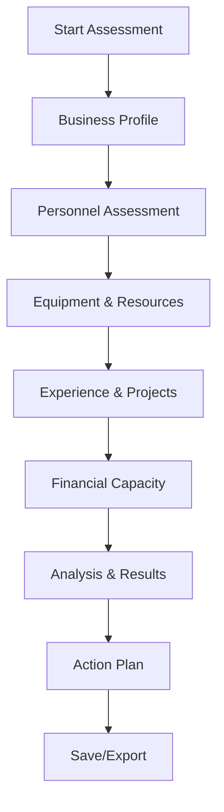
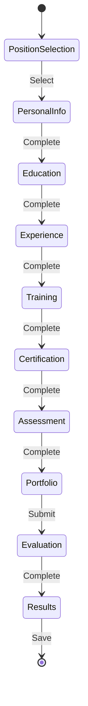
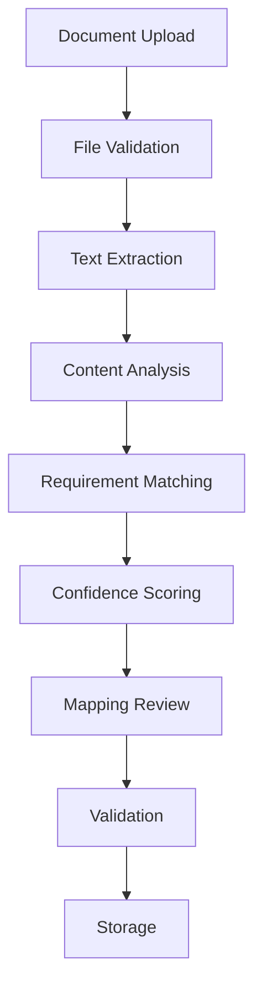

# UI Flows Refinement

## Overview

This document refines the UI flows for all mini-apps based on the completed database structure and backend API specifications. It provides detailed interaction patterns, data flow visualizations, and component specifications for optimal user experience.

## Design Principles

### User Experience
- **Progressive Disclosure**: Show essential information first, details on demand
- **Contextual Actions**: Actions relevant to current state and user permissions
- **Feedback Systems**: Real-time validation, progress indicators, success/error states
- **Accessibility**: WCAG 2.1 AA compliance, keyboard navigation, screen reader support

### Data Presentation
- **Information Hierarchy**: Most important data prominently displayed
- **Progressive Loading**: Lazy load complex data, show skeletons during loading
- **Offline Capability**: Critical data cached locally for offline access
- **Export Options**: PDF reports, Excel exports, JSON data dumps

### Interaction Patterns
- **Wizard Flows**: Step-by-step processes for complex tasks
- **Dashboard Cards**: Quick access to key metrics and actions
- **Modal Dialogs**: Focused interactions without navigation
- **Inline Editing**: Direct editing where appropriate

## Tender Eligibility Checker

### Main Flow



### Screen Specifications

#### Input Selection Screen
```
┌─────────────────────────────────────────────────────────────┐
│ Tender Eligibility Checker                                │
├─────────────────────────────────────────────────────────────┤
│ Select Assessment Type:                                    │
│ □ Quick Assessment (Basic requirements check)             │
│ □ Full Assessment (Comprehensive analysis)                │
│ □ Custom Assessment (Select specific domains)             │
├─────────────────────────────────────────────────────────────┤
│ Business Entity:                                          │
│ [Dropdown with search] PT. Konstruksi Maju ▾              │
├─────────────────────────────────────────────────────────────┤
│ Tender Information:                                        │
│ Tender Number: [Input] 001/TENDER/2024                     │
│ Tender Value: [Input] IDR 50,000,000,000                   │
│ Tender Category: [Dropdown] Gedung ▾                      │
├─────────────────────────────────────────────────────────────┤
│ Supporting Documents:                                      │
│ 📎 Upload License Documents                                │
│ 📎 Upload Certification Documents                          │
│ 📎 Upload Financial Statements                             │
│ 📎 Upload Personnel Data                                   │
├─────────────────────────────────────────────────────────────┤
│ [Secondary] Load from Previous Assessment                  │
│ [Primary] Start Assessment                                 │
└─────────────────────────────────────────────────────────────┘
```

#### Analysis Progress Screen
```
┌─────────────────────────────────────────────────────────────┐
│ Analysis in Progress...                                    │
├─────────────────────────────────────────────────────────────┤
│ ⏳ Document Processing: ████████░░░░░ 80%                  │
│ ⏳ Legal Compliance Check: ██████████░░ 90%                │
│ ⏳ Certification Validation: █████████░░░ 85%              │
│ ⏳ Personnel Qualification: ████████░░░░░ 75%              │
│ ⏳ Financial Capacity: ██████████░░ 95%                    │
├─────────────────────────────────────────────────────────────┤
│ Current Step: Validating Personnel Competencies           │
│ Estimated time remaining: 2 minutes                       │
├─────────────────────────────────────────────────────────────┤
│ [Cancel] [View Details]                                    │
└─────────────────────────────────────────────────────────────┘
```

#### Results Dashboard
```
┌─────────────────────────────────────────────────────────────┐
│ Assessment Results                                        │
├─────────────────────────────────────────────────────────────┤
│ Overall Eligibility:                                      │
│ 🟢 ELIGIBLE (Score: 87/100)                               │
├─────────────────────────────────────────────────────────────┤
│ Domain Breakdown:                                         │
│ 🟢 Legal & Licensing: 95/100                              │
│ 🟢 Business Certification: 90/100                         │
│ 🟡 Personnel Competency: 82/100 ⚠️ Minor Gaps            │
│ 🟢 Experience & Track Record: 88/100                      │
│ 🟢 Financial Capacity: 92/100                             │
├─────────────────────────────────────────────────────────────┤
│ Quick Actions:                                             │
│ [View Gap Analysis] [Generate Report] [Save Assessment]   │
└─────────────────────────────────────────────────────────────┘
```

### Data Flow Integration

#### Real-time Updates
- WebSocket connection for analysis progress
- Automatic refresh of results when analysis completes
- Push notifications for critical findings

#### Error Handling
- Validation errors shown inline with field highlights
- Document upload failures with retry options
- Analysis timeouts with manual retry capability

## SBU Readiness Assessment

### Wizard Flow Structure



### Interactive Components

#### Personnel Matrix
```
Personnel Requirements for Kualifikasi Besar
┌─────────────────────────────────────────────────────────────┐
│ Position              │ Required │ Current │ Gap │ Status   │
├───────────────────────┼──────────┼─────────┼─────┼──────────┤
│ Manajer Konstruksi    │ 5        │ 3       │ 2   │ ⚠️ Gap   │
│ Supervisor            │ 10       │ 8       │ 2   │ ⚠️ Gap   │
│ Teknisi               │ 20       │ 15      │ 5   │ ⚠️ Gap   │
│ Administrasi          │ 3        │ 4       │ 0   │ ✅ OK    │
└─────────────────────────────────────────────────────────────┤
│ [Add Personnel] [Import from Database]                     │
└─────────────────────────────────────────────────────────────┘
```

#### Progress Visualization
```
Assessment Progress
┌─────────────────────────────────────────────────────────────┐
│ □ Business Profile (Complete)                              │
│ □ Personnel Assessment (In Progress)                       │
│ □ Equipment & Resources (Pending)                          │
│ □ Experience & Projects (Pending)                          │
│ □ Financial Capacity (Pending)                             │
└─────────────────────────────────────────────────────────────┘
```

### Dynamic Calculations

#### Real-time Scoring
- Personnel score updates as data is entered
- Equipment valuation calculates automatically
- Experience points accumulate from project history
- Financial ratios computed from balance sheet data

#### Conditional Logic
- Show additional fields based on classification target
- Enable/disable sections based on completion status
- Display warnings for critical gaps

## SKK Competency Assessment

### Multi-step Process



### Advanced Components

#### Competency Radar Chart
```
Competency Profile: Ahmad Suryono
┌─────────────────────────────────────────────────────────────┐
│                     Education (85)                         │
│              Training (78)      Certification (92)         │
│                                                             │
│         Experience (71)                  Assessment (88)    │
│                                                             │
│                     Portfolio (76)                          │
│                                                             │
│ Target: SKK Ahli Struktur (Threshold: 80)                  │
└─────────────────────────────────────────────────────────────┘
```

#### Timeline Visualization
```
Career Development Timeline
┌─────────────────────────────────────────────────────────────┐
│ 2018: S1 Teknik Sipil Completion                           │
│ 2019: Junior Engineer Position                             │
│ 2020: Basic Training Course                                │
│ 2021: Professional Certification                           │
│ 2022: Project Supervisor Role                              │
│ 2023: Advanced Training                                    │
│ 2024: SKK Assessment Preparation                           │
└─────────────────────────────────────────────────────────────┘
```

### Smart Recommendations

#### Gap Analysis Engine
- Identifies weakest competency areas
- Suggests specific training programs
- Recommends certification pathways
- Estimates timeline and cost for upgrades

## Evidence Mapping System

### Document Processing Flow



### Interactive Mapping Interface

#### Document Viewer with Highlights
```
Document: Izin Usaha Konstruksi.pdf
┌─────────────────────────────────────────────────────────────┐
│ [Highlight] PT. Maju Bersama                              │
│ [Highlight] Izin Usaha Konstruksi                         │
│ [Highlight] Kualifikasi Besar                             │
│ [Highlight] Nomor: 12345/IUK/2024                         │
│ [Highlight] Berlaku sampai: 31 Desember 2029              │
├─────────────────────────────────────────────────────────────┤
│ Mapped Requirements:                                       │
│ ✅ Business Entity Registration                            │
│ ✅ Construction License                                    │
│ ✅ Classification Level                                    │
│ ✅ Validity Period                                         │
├─────────────────────────────────────────────────────────────┤
│ Confidence Scores:                                         │
│ Business Entity: 98%                                       │
│ License Number: 95%                                        │
│ Classification: 92%                                        │
│ Validity: 100%                                             │
└─────────────────────────────────────────────────────────────┘
```

#### Bulk Processing Dashboard
```
Evidence Mapping Queue
┌─────────────────────────────────────────────────────────────┐
│ Document                  │ Status    │ Progress │ Actions   │
├───────────────────────────┼───────────┼──────────┼───────────┤
│ license.pdf               │ Processing│ ███████░░░│ [View]    │
│ certification.pdf         │ Completed │ ██████████│ [Review]  │
│ financial_statement.pdf   │ Failed    │ █░░░░░░░░░│ [Retry]   │
│ personnel_data.xlsx       │ Queued    │ ░░░░░░░░░░│ [Cancel]  │
└─────────────────────────────────────────────────────────────┘
```

## Workforce Assignment

### Matching Algorithm Visualization

#### Compatibility Matrix
```
Position: Project Manager - Gedung Tinggi
┌─────────────────────────────────────────────────────────────┐
│ Candidate            │ Match % │ Skills │ Exp │ Avail │ Risk │
├──────────────────────┼─────────┼────────┼─────┼───────┼──────┤
│ Ahmad Suryono        │ 94%     │ 96%    │ 90% │ 95%   │ Low  │
│ Siti Nurhaliza       │ 87%     │ 89%    │ 85% │ 90%   │ Low  │
│ Budi Santoso         │ 82%     │ 85%    │ 80% │ 85%   │ Med  │
│ Maya Sari            │ 76%     │ 78%    │ 75% │ 80%   │ Med  │
└─────────────────────────────────────────────────────────────┘
```

#### Resource Allocation Chart
```
Team Utilization Overview
┌─────────────────────────────────────────────────────────────┐
│ Resource              │ Current │ Proposed │ Max   │ Status  │
├───────────────────────┼─────────┼──────────┼───────┼─────────┤
│ Ahmad Suryono (PM)    │ 60%     │ 85%      │ 90%   │ ⚠️ High │
│ Siti Nurhaliza (Eng)  │ 70%     │ 80%      │ 90%   │ OK      │
│ Budi Santoso (Tech)   │ 50%     │ 75%      │ 90%   │ OK      │
│ Maya Sari (Admin)     │ 40%     │ 65%      │ 90%   │ OK      │
└─────────────────────────────────────────────────────────────┘
```

### Optimization Features

#### Constraint Management
- Skill requirements per position
- Availability calendars
- Budget constraints
- Geographic preferences
- Certification requirements

#### Scenario Planning
- Compare different team compositions
- Cost-benefit analysis
- Risk assessment
- Timeline optimization

## Cross-App Integration

### Unified Dashboard

#### Activity Feed
```
Recent Activities
┌─────────────────────────────────────────────────────────────┐
│ 🏢 Tender Assessment completed for PT. Maju                │
│ 👥 SKK Assessment completed for Ahmad Suryono             │
│ 📄 Evidence mapping completed for license.pdf             │
│ 👷 Workforce assignment optimized for Project Alpha       │
│ 📊 SBU Readiness updated for PT. Maju                      │
└─────────────────────────────────────────────────────────────┘
```

#### Quick Actions Panel
```
Quick Actions
┌─────────────────────────────────────────────────────────────┐
│ [New Tender Assessment] [Upload Documents]                 │
│ [Add Personnel] [Generate Report]                          │
│ [Schedule Training] [Review Compliance]                    │
└─────────────────────────────────────────────────────────────┘
```

### Data Synchronization

#### Real-time Updates
- Changes in one app reflect immediately in others
- Cross-reference validation across entities
- Automated data consistency checks

#### Conflict Resolution
- Version conflict detection
- Manual override capabilities
- Audit trail for changes

## Mobile Responsiveness

### Adaptive Layouts

#### Card-based Design
- Collapsible sections on mobile
- Swipe gestures for navigation
- Touch-optimized controls
- Readable typography scaling

#### Progressive Web App Features
- Offline data access
- Push notifications
- Home screen installation
- Background sync

## Error Handling & Recovery

### User-friendly Error States

#### Validation Errors
```
Please correct the following errors:
• Tender value must be greater than IDR 10,000,000,000
• At least 3 personnel records required
• Financial statements must be from last 2 years
```

#### System Errors
```
We're experiencing technical difficulties.
• [Retry] - Try the operation again
• [Report Issue] - Send error details to support
• [Go Back] - Return to previous screen
```

### Recovery Flows

#### Auto-save Functionality
- Draft saving every 30 seconds
- Recovery from browser crashes
- Version history for complex assessments

#### Guided Recovery
- Step-by-step error resolution
- Alternative input methods
- Contact support integration

## Performance Optimization

### Loading States

#### Skeleton Screens
```
Loading Assessment Results...
┌─────────────────────────────────────────────────────────────┐
│ ░░░░░░░░░░░░░░░░░░░░░░░░░░░░░░░░░░░░░░░░░░░░░░░░░░░░░░░░░░░░ │
│ ░░░░░░░░░░░░░░░░░░░░░░░░░░░░░░░░░░░░░░░░░░░░░░░░░░░░░░░░░░░░ │
│ ░░░░░░░░░░░░░░░░░░░░░░░░░░░░░░░░░░░░░░░░░░░░░░░░░░░░░░░░░░░░ │
└─────────────────────────────────────────────────────────────┘
```

#### Progressive Loading
- Load critical data first
- Lazy load detailed information
- Background loading for analytics

### Caching Strategy

#### Client-side Caching
- Frequently accessed data cached in IndexedDB
- Offline queue for actions
- Intelligent cache invalidation

This refined UI specification provides the detailed interaction patterns and component designs needed to implement a world-class user experience for the KonstruksiAI platform.</content>
<parameter name="filePath">ui-flows-refinement.md